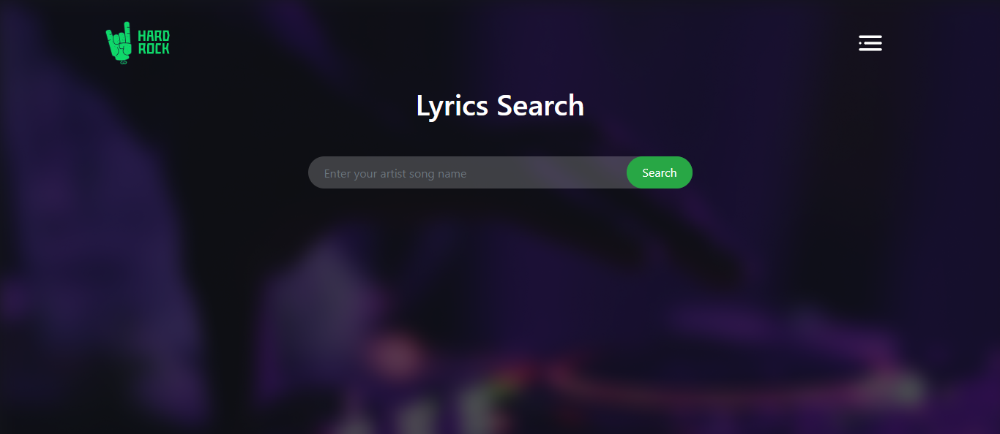
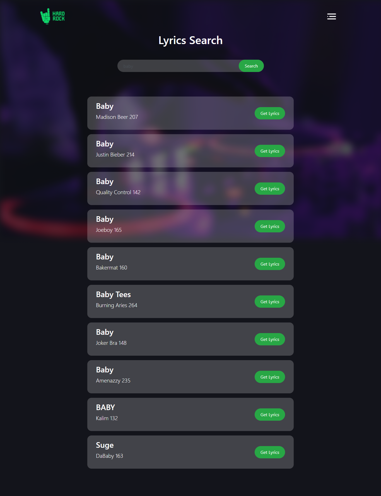
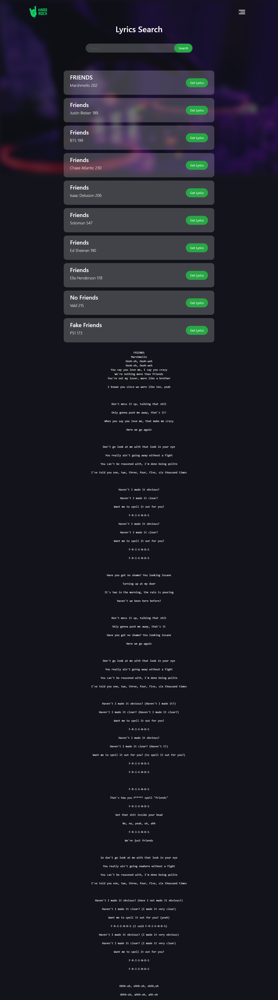

# Hard-rock
## Features
1. Hard-rock is a Lyrics Searching website.
2. A user easily can find any lyrics by this site.
3. If users search any word then they get suggestions of lyrics of this particular word.
4. Users can arrange results based on individual song title or album.
5. It comes with a clean and straightforward search system.
6. It provides segments of lyrics in search results to help you identify the song before heading to the full lyrics’ page.
7. Outstanding performance when searching current hits.

# Technology
HTML5, CSS3, JavaScript, JSON etc.

# Tools
VS Code, Git, Chrome Dev Tool, Figma.

# LiveSite Link
https://rakhiakter.github.io/hard-rock/

# Resume

[https://drive.google.com/file/d/1r0AJmoRTKkRU9aZjMwurN2SfN1cHxCyP/view?usp=sharing](https://drive.google.com/file/d/1r0AJmoRTKkRU9aZjMwurN2SfN1cHxCyP/view?usp=sharing)

# ScreenShots

# hard-rock-solution
api link: https://api.lyrics.ovh/suggest/summer
